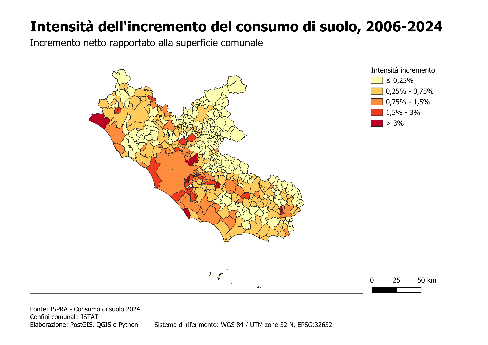
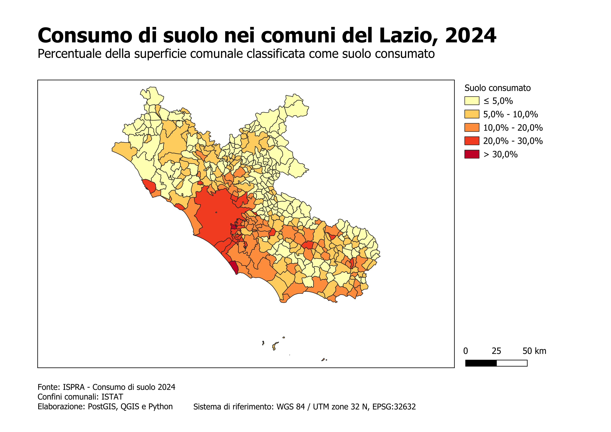
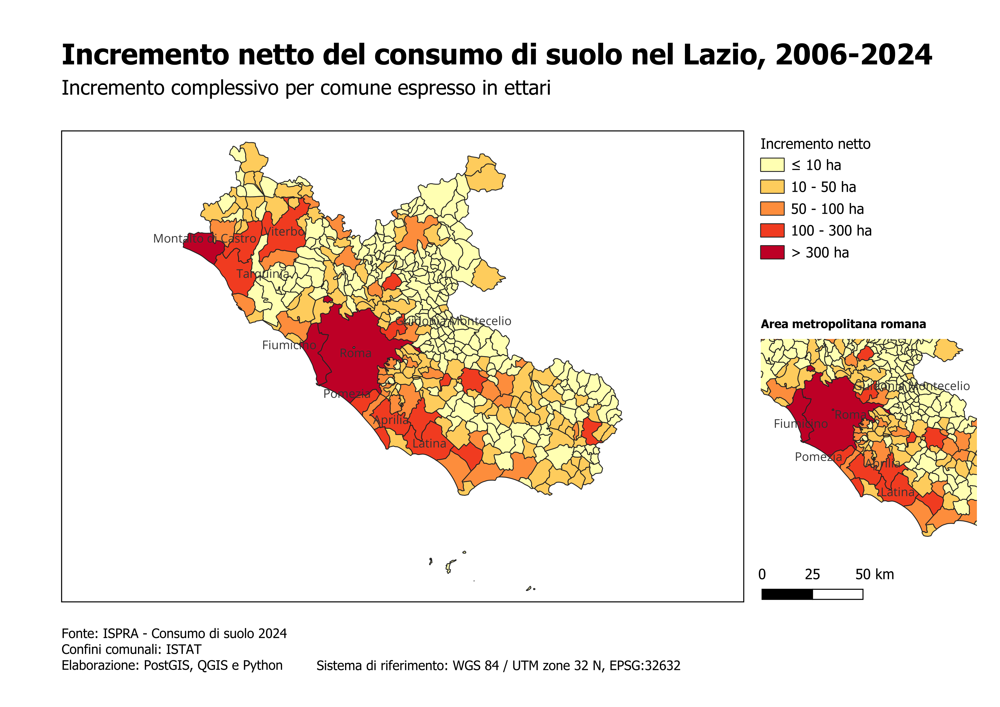

# Spatial Patterns of Land Consumption in Lazio (Italy)

A reproducible geospatial analysis of land consumption in the Lazio region (Italy) using official ISTAT administrative boundaries and ISPRA land consumption datasets (2006–2024).

This project combines PostgreSQL/PostGIS, Python ETL pipelines, SQL processing and QGIS cartography to produce reproducible spatial analyses.

---



---

## Technologies

- PostgreSQL
- PostGIS
- Docker
- Python
- GeoPandas
- Pandas
- SQL
- QGIS
- Git

---

## Workflow

```text
             ISTAT boundaries
                    │
                    │
                    ▼
              PostgreSQL/PostGIS
                    ▲
                    │
         ISPRA land consumption
                    │
                    ▼
             SQL processing
                    │
                    ▼
           Spatial analysis
                    │
                    ▼
               QGIS maps
```

---

## Repository structure

```text
lazio-consumo-suolo/

├── data/
├── outputs/
│   └── maps/
├── python/
├── qgis/
├── sql/
├── README.md
└── requirements.txt
```

---

# Main analyses

## 1. Land consumption in 2024

Percentage of municipal territory classified as consumed land.



### Main findings

- Highest percentages are concentrated within the Rome metropolitan area.
- Ciampino represents the municipality with the highest proportion of consumed land.
- Several municipalities surrounding Rome exceed 20% of municipal land consumption.

---

## 2. Net land consumption increase (2006–2024)

Total increase in consumed land.



### Main findings

- Rome records the largest absolute increase.
- Montalto di Castro emerges as an unexpected hotspot outside the metropolitan area.
- Significant growth is also observed in Guidonia Montecelio, Pomezia, Fiumicino and Latina.

---

## 3. Relative land consumption intensity

Increase relative to municipal area.


### Main findings

- Several municipalities within the Rome metropolitan belt display the highest relative growth.
- Colleferro, Ciampino, Guidonia Montecelio and Anzio emerge as municipalities experiencing particularly intense territorial transformation.
- The results highlight spatial patterns consistent with metropolitan expansion processes.

---

# Data sources

- ISPRA – National Land Consumption Database
- ISTAT – Administrative Boundaries (2026)

---

# Reproducibility

Clone the repository

```bash
git clone https://github.com/<your_username>/lazio-consumo-suolo.git
cd lazio-consumo-suolo
```

Start PostgreSQL/PostGIS

```bash
docker compose up -d
```

Import ISTAT boundaries

```bash
py python/import_istat.py
```

Import ISPRA land consumption data

```bash
py python/import_ispra.py
```

The database is automatically populated and ready for spatial analysis in QGIS.

---

# Future developments

- Hot Spot Analysis (Getis-Ord Gi*)
- Moran's I spatial autocorrelation
- Additional temporal analyses
- Land consumption typologies